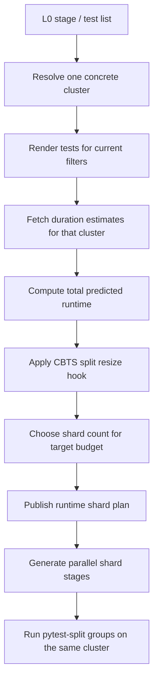

# Design Doc: Dynamic Test Sharding for L0 CI

Status: Draft
Author: Yuanjing Xue
Last updated: 2026-07-07

## 1. Background

L0 integration tests run as parallel Jenkins stages, and each stage runs one
*shard* of a larger test list. Today the shard layout is **statically hardcoded**
in `jenkins/L0_Test.groovy`: every stage declares how many shards its test list is
split into (`split_count`) and which shard it owns (`splitId`). For example, the
A10 PyTorch tests are hardcoded to always split into two stages.

At runtime each stage asks `pytest-split` for its slice using the
`least_duration` algorithm, which greedily bin-packs tests into `split_count`
groups of roughly equal *predicted* wall-time, based on a `.test_durations` file
of per-test timings.

Some mechanisms already move toward cluster-awareness and runtime resizing:

- **Per-cluster durations.** When enabled, each stage reads and writes a
  cluster-specific durations file so the bin-packing baseline reflects the
  hardware it actually ran on, instead of a shared cross-cluster average.
- **Centralized duration telemetry.** Test duration records are available from
  OpenSearch, which can provide fresher per-test and per-cluster timing data
  than a workspace-local `.test_durations` file.
- **CBTS split resize.** For narrowed-scope runs, `split_count` is already
  rewritten after the config is built but before the parallel stages launch. This
  is direct precedent that resizing shard counts programmatically is feasible.

## 2. Problem statement

Traffic for a given test stage is now **load-balanced across multiple clusters**,
and the same test runs at meaningfully different speeds on different clusters. But
`split_count` is fixed in code, while the cluster a stage lands on is not known
until scheduling time. This produces two failure modes:

- **Slow cluster → timeout / long tail.** A shard count tuned for a fast cluster
  under-shards on a slow one; each shard exceeds its time budget or drags out the
  critical path.
- **Fast cluster → waste.** A shard count tuned for the slow cluster over-shards
  on a fast one, spawning more pods/allocations than needed and adding queue and
  scheduling overhead for little wall-time benefit.

The existing `least_duration` packing cannot fix this: it decides *which* tests go
in each shard, but not *how many* shards exist. The shard count is the lever, and
it is currently static.

### Goal

Choose the shard count (and therefore the number of parallel stages) **dynamically**,
per stage, so that each shard's predicted wall-time on the cluster it actually runs
on stays near a target budget. The planner should choose the cluster first, then
size the shards using duration data from that same cluster.
The planner should retrieve per-test duration estimates from OpenSearch, scoped to
the resolved cluster when possible, and use local duration files only as a
fallback/bootstrap path.

### Non-goals

- Changing the intra-shard packing algorithm.
- Cross-stage rebalancing or moving tests between platforms.
- Re-sharding after a stage has already started.

## 3. Key constraint

The number of parallel stages is normally fixed when the pipeline's job map is
built, which happens **before** any node is allocated. But the concrete cluster a
stage runs on is only resolved later, at scheduling time. This design therefore
uses a two-phase flow: first run a lightweight planner that resolves placement,
then generate the shard stages from the cluster-specific plan.

## 4. Proposed design

Add a planning step that runs before the parallel shard stages are created. For
each sharded stage it:

1. Resolves the concrete cluster for the stage's platform.
2. Renders the stage's test list so it knows which tests will actually run under
   the current filters.
3. Retrieves matching per-test durations from OpenSearch, preferring records from
   the resolved cluster and falling back to local per-cluster/shared duration
   files when OpenSearch has no usable data.
4. Sums predicted per-test durations to get total predicted stage time, assigning
   a configurable default to tests not yet in the durations file.
5. Sets the shard count so each shard's predicted time stays near the target
   budget, clamped to a maximum to protect the pod/quota budget.
6. Publishes a shard plan that records the resolved cluster, test context, shard
   count, duration source coverage, and generated stage names.
7. Creates the parallel shard stages from the published plan.

Everything downstream stays the same: each generated stage runs its group via the
same `pytest-split` path, using the same duration estimates materialized into the
format `pytest-split` already consumes.

### Cluster-first invariant

One rendered test list maps to exactly one resolved cluster for a given run. This
keeps duration estimates meaningful: the same test case can have materially
different runtimes on different clusters, so mixing shards from one test list
across clusters would combine incompatible timing distributions. If the planner
chooses `cluster-A` for a test list, it computes the shard count from
`cluster-A` duration history and every generated shard for that list is submitted
to `cluster-A`.

### Duration source

OpenSearch becomes the preferred source for duration estimates. The planner
queries by test node id plus platform/stage and cluster metadata, aggregates recent
successful runs into a stable estimate, and records how many tests used exact,
fallback, or default durations. If OpenSearch is unavailable, missing, or returns
too little coverage for a stage, the planner falls back to the existing
per-cluster `.test_durations_<cluster>` file, then the shared `.test_durations`
file, then the default duration.

### Tunables

- **Target per-shard time** (per-platform overridable).
- **Maximum shard count** per stage.
- **Default duration** for tests missing from the durations file.
- **OpenSearch lookback / aggregation policy** for choosing the timing estimate.
- **Minimum duration coverage** required before trusting OpenSearch for a stage.
- A **kill switch** to fall back to the fully-static layout during rollout.

### Runtime shard plan

The planning stage should publish a small machine-readable plan, for example JSON
in the workspace or a Jenkins variable, that becomes the source of truth for the
second phase. The plan should include the resolved cluster, selected shard count,
stage-name suffix or layout identifier, duration source statistics, and enough
metadata for retries, result uploads, and test-to-stage mapping to agree on the
same layout. The resolved cluster is part of the plan identity so all shards from
the same test list target the same cluster.

## 5. Interactions / risks

- **Downstream stage mapping.** The test-to-stage mapping tool relies on the shard
  layout. The runtime shard plan should be the source of truth, because the final
  stage map is generated after placement is known rather than copied directly from
  the source literal.
- **Result reuse and retries.** A changed shard count must not collide with a prior
  run's cached results. Encode the shard count in the stage name (as CBTS already
  does for narrowed stages) so differing layouts stay distinct.
- **Planning-stage latency.** The planner adds a serial step before shard stages
  launch. Keep it lightweight, cache OpenSearch responses where practical, and
  ensure failures fall back to the static layout rather than blocking CI.
- **Single-cluster capacity.** Because one rendered test list is pinned to one
  cluster for timing consistency, the selected cluster must have enough capacity
  for the generated shards. The planner should account for cluster capacity or
  fall back to a smaller/static layout when the chosen cluster cannot absorb the
  planned parallelism.
- **Duration freshness and coverage.** OpenSearch may be missing new tests,
  contain stale timings, or have sparse data for a cluster. The planner should log
  coverage, use conservative defaults for unknown tests, and fall back to local
  duration files when coverage is too low.
- **OpenSearch availability.** The CI path must tolerate query failures without
  blocking tests. Treat OpenSearch lookup as best-effort and fall back to the
  existing local duration files.
- **Count stability.** Small duration drift shouldn't flip the shard count every
  run. Consider hysteresis (only change the count when predicted time crosses a
  band) to keep the layout and result reuse stable.
- **Budget guardrails.** The maximum-shard cap prevents a slow-cluster estimate
  from exploding the shard count.

## 6. Rollout plan

1. Land the planning step behind the kill switch, defaulted **off**, logging the
   shard plan it *would* publish next to the current static layout (shadow mode).
2. In shadow mode, also log OpenSearch duration coverage and compare OpenSearch
   estimates against the current local duration-file estimates.
3. Compare shadow counts vs. static and observed stage wall-times for a week.
4. Enable for one low-risk platform with a conservative target budget and a
   static-layout fallback.
5. Verify downstream mapping, result reuse, retry accounting, plan publication,
   dynamic stage generation, and OpenSearch fallback behavior.
6. Expand platform-by-platform; tune the budget, cap, and duration aggregation
   policy from observed tails.

## 7. Open questions

- What is the best mechanism for publishing the runtime shard plan between the
  planning phase and the generated parallel stage phase?
- Can every target Jenkins path safely create nested or delayed parallel shard
  stages from the runtime plan?
- Does the test-to-stage mapping tool consume the resolved runtime layout or the
  source literal?
- What target per-shard time fits each platform? Derive from current p95 stage
  wall-times.
- Which OpenSearch index and schema should be the source of truth for per-test
  duration records?
- What aggregation should the planner use: latest successful run, median over a
  lookback window, p75/p90 for safety, or cluster-specific fallback to shared
  history?
- Should the planner materialize OpenSearch results into a temporary
  `pytest-split` durations file, or should the test runner learn to read
  OpenSearch-backed durations directly?
